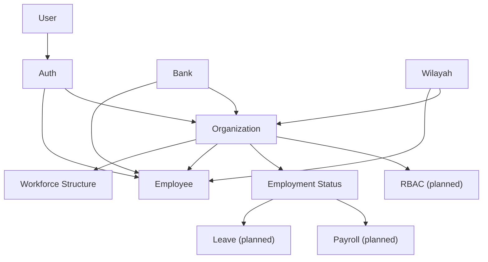

# PRD Index

Daftar seluruh Product Requirements Document di `hris-docs`. Selalu update tabel ini saat PRD baru dibuat atau versi/status berubah (`scaffold-prd` §1, mandatory).

## Global

| Dokumen | Versi | Status | Terakhir Update |
|---|---|---|---|
| [product-vision.md](product-vision.md) | 1.0.0 | Draft | 2026-08-01 18:00:00 |

## Modul

| Modul | Versi | Status | Depends On | Consumed By | Terakhir Update |
|---|---|---|---|---|---|
| [auth.md](auth.md) | 1.0.0 | Draft | user@1.0.0 | employee@1.0.0, organization@1.0.0 | 2026-07-26 13:17:00 |
| [organization.md](organization.md) | 2.0.0 | Draft | — | workforce-structure@1.0.0, employee@1.0.0, employment-status@1.0.0, rbac@planned, payroll@planned, attendance@planned | 2026-08-01 17:00:00 |
| [employment-status.md](employment-status.md) | 1.0.0 | Draft | organization@2.0.0 | employee@1.0.0, leave@planned, payroll@planned | 2026-08-01 15:00:00 |
| [bank.md](bank.md) | 1.0.0 | Draft | — | employee@1.0.0, organization@1.0.0, payroll@planned | 2026-08-01 16:00:00 |
| [region.md](region.md) | 1.0.0 | Draft | — | employee@1.0.0, organization@1.0.0 | 2026-08-01 16:00:00 |

> **Belum dimigrasi ke `hris-docs`** (masih di `hris-backend/docs/PRD/`): `user.md`, `workforce-structure.md`, `employee.md`. Lihat [product-vision.md](product-vision.md) §5.1.

## Dependency Graph

## Ringkasan Gap

| Item | Kondisi |
|---|---|
| PRD `user`, `workforce-structure`, `employee` | Masih di `hris-backend/docs/PRD/`, belum dipindah ke `hris-docs` — migrasi menyusul (pola sama seperti `organization.md`). |
| `PRD/_shared/glossary.md` | Belum dibuat — belum ada istilah lintas-modul yang cukup mendesak diangkat. |
